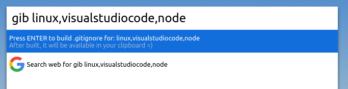
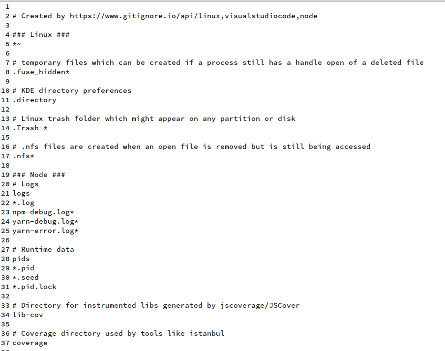

# Cerebro Plugin .gitignore Builder

Cerebro plugin to build **.gitignore** files using [gitignore.io](https://www.gitignore.io/)

## Usage

In Cerebro, type `gib ` and then the OS, IDEs, or programming languages that you are using.
Then hit ENTER and the .gitignore content will be sent to your clipboard.

Example of use:
`gib linux,node,visualstudiocode`

## Installing

* Type `plugins gib` into Cerebro
* Click `install

## TODOs

* Minify the build

## Related

- [Cerebro](http://github.com/KELiON/cerebro) – main repo for Cerebro app;
- [gitignore.io](https://www.gitignore.io/) - Service to create .gitignore files for your project;

## License

MIT © [Wesley Egberto](https://github.com/wesleyegberto)